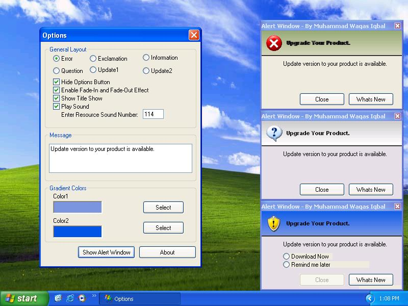



## MSN Style Alert Window 4\.0

### Description

MSN style alert now in windows form with title bar, it neither

requires activeX control nor any DLL file. You can even change sound

of Alert Window, just by changing 'PlaySoundResource' in FormLoad

event form 101 to 103. You can also add your own sound, just add

wave file in the resource file under the heading 'WAVE'.

Gradient effect is now included in the version of Alert Window in

prior version you could use only one color of heading area but in

this version you can use gradient effect of two colors of your

desire. You can not only change the colors of gradient of your of

desire but also change the angle of gradient. For example: 90 or -90.

All you need to do just change color and angle in FormLoad Event as

simple as that.

Another upgrade version of Alert Window is now here, in this version

of Alert Window Fade-In and Fade-Out effect of form is enhanced. You

can set FadeIn and FadeOut duration as you like by adding 'Step'

code in ForNext loop in FormLoad Event from 1 to 255 depends on your

need. Moreover some builtin icons are added that has rang from

1 to 6 you can change icon just change the icon number in SetIcon

from 1 to 6 in FormLoad Event.
 
### More Info
 
works best on XP with resolution 800x600

             |
---                |---
**Submitted On**   |2005-06-15 15:12:28
**By**             |[Muhammad Waqas Iqbal](https://github.com/Planet-Source-Code/PSCIndex/blob/master/ByAuthor/muhammad-waqas-iqbal.md)
**Level**          |Intermediate
**User Rating**    |5.0 (10 globes from 2 users)
**Compatibility**  |VB 6\.0
**Category**       |[Custom Controls/ Forms/  Menus](https://github.com/Planet-Source-Code/PSCIndex/blob/master/ByCategory/custom-controls-forms-menus__1-4.md)
**World**          |[Visual Basic](https://github.com/Planet-Source-Code/PSCIndex/blob/master/ByWorld/visual-basic.md)
**Archive File**   |[MSN\_Style\_1905026242005\.zip](https://github.com/Planet-Source-Code/muhammad-waqas-iqbal-msn-style-alert-window-4-0__1-61315/archive/master.zip)

